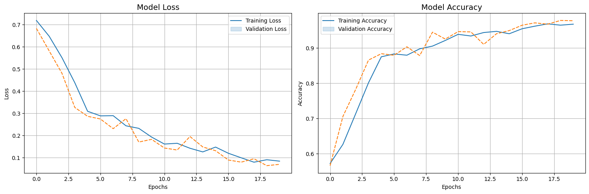
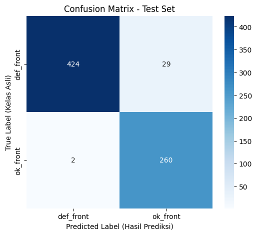
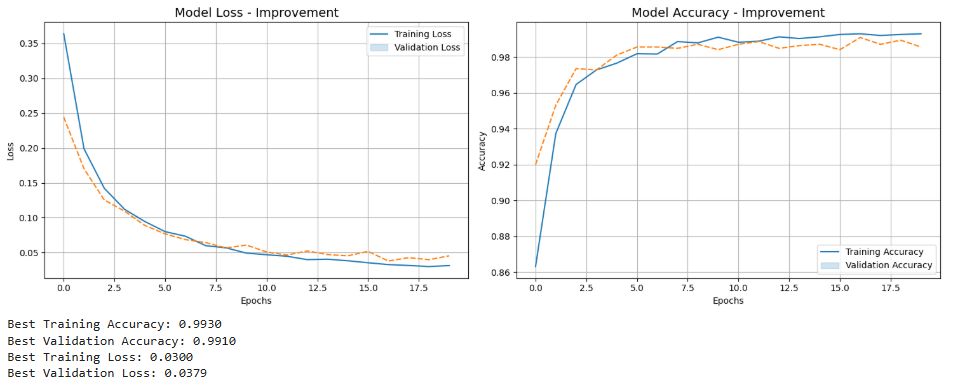
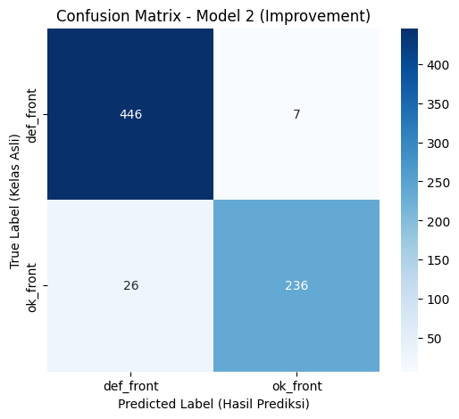
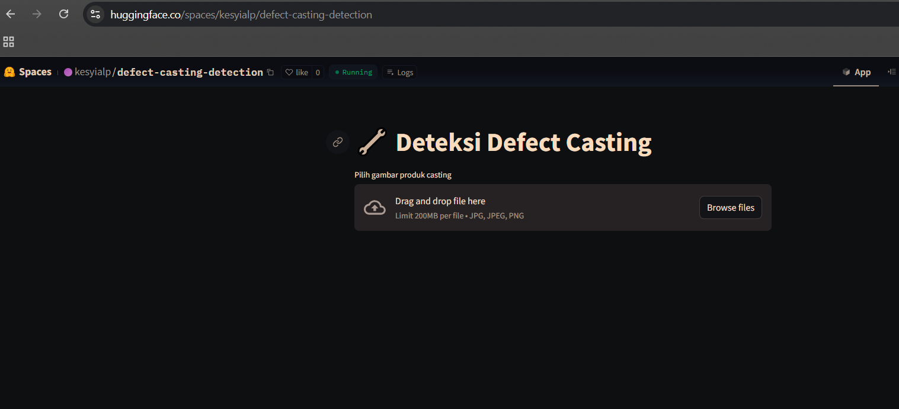
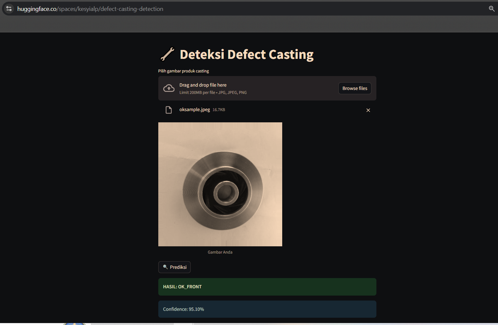

# Casting Defect Detection Using Computer Vision

> Automated quality inspection for submersible pump impeller casting products 
> using CNN and Transfer Learning (MobileNetV2)

---

## Overview

### Problem Statement
Casting defects (air holes, burrs, shrinkage, etc.) are a major problem in the 
metals industry. Quality inspection is still commonly done manually, resulting in:
- Slow and inconsistent inspections
- Defective products reaching customers
- Entire order rejections causing significant business losses

### Objective
Build a computer vision model to automatically classify casting products as 
**defective** or **OK**, making inspections faster, consistent, and accurate.

### Target Users
Quality Control (QC) Inspectors, QA Managers, Plant Managers, and Maintenance 
Technicians on the production line.

---

## Dataset

**Source:** [Kaggle - Real Life Industrial Dataset of Casting Product](https://www.kaggle.com/datasets/ravirajsinh45/real-life-industrial-dataset-of-casting-product)

| Split | Defective (def_front) | OK (ok_front) | Total |
|-------|-----------------------|---------------|-------|
| Train | 3,758 | 2,875 | 6,633 |
| Test  | 453   | 262   | 715   |

---

## Project Workflow

This project went through **2 versions**:

### Version 1 — Experimentation (`model_comparison_cnn_vs_mobilenetv2.ipynb`)
Comparing two approaches:
- **Model 1:** CNN built from scratch
- **Model 2:** Transfer Learning with MobileNetV2

### Version 2 — Production & Deployment (`casting_defect_v2_deployment.ipynb`)
MobileNetV2 only, re-trained in a compatible environment for Hugging Face 
deployment. Version 1 could not be deployed due to TensorFlow version 
incompatibility with HF Spaces, so a new conda environment was configured 
to match HF requirements. Rather than retraining all models from Version 1, 
only MobileNetV2 was selected for retraining due to hardware constraints — 
training the full CNN scratch model required significantly longer processing 
time on a local machine, making MobileNetV2 the more practical choice for 
production deployment.

---

## Results & Model Comparison

| Metric | Model 1 (CNN Scratch) | Model 2 (MobileNetV2) |
|--------|-----------------------|-----------------------|
| Test Accuracy | **95.66%** | 95.38% |
| Training Speed | Slower | **Faster** ✅ |
| Deployable to HF | ❌ | ✅ |

---

### Model 1 — CNN Scratch

- Defective detected: 424/453 (93.6%)
- OK detected: 260/262 (99.2%)
- False Negatives: 29 — defective products passed as OK
- False Positives: 2 — OK products flagged as defective
- Total misclassified: 31/715 (4.34%)

---

### Model 2 — MobileNetV2 (Improvement)

- Defective detected: 446/453 (98.5%)
- OK detected: 236/262 (90.1%)
- False Negatives: 7 — defective products passed as OK
- False Positives: 26 — OK products flagged as defective
- Total misclassified: 33/715 (4.62%)

---

## Demo & Deployment

**Live Demo:** [🤗 Hugging Face Spaces](https://huggingface.co/spaces/kesyialp/defect-casting-detection)

Note: To try the model in hf, you can use the image from the kaggle dataset that has been placed above (https://www.kaggle.com/datasets/ravirajsinh45/real-life-industrial-dataset-of-casting-product) or search on Google with the keyword "submersible pump impeller" but adjust the photo with an angle/view/type that matches the dataset. So that it is similar to the shape in the dataset so that the model can recognize it.
---

## Tech Stack

| Technology | Usage |
|------------|-------|
| TensorFlow / Keras | Model training & inference |
| MobileNetV2 | Transfer learning backbone |
| Streamlit | Web app framework |
| Hugging Face Spaces | Model deployment |
| VS Code | Development environment |
| Kaggle | Dataset source |

---

## Conclusion

Both models achieved strong performance (>95% accuracy) on the casting defect 
dataset. The key finding is that **MobileNetV2 offers a better trade-off** — 
slightly lower accuracy (95.38% vs 95.66%) but significantly faster training 
time and better deployability, making it the preferred choice for production.

**Important limitation:** This model is trained specifically on top-down grayscale 
images of submersible pump impellers from casting. Performance may degrade 
significantly on different impeller types, angles, or surface finishes due to 
domain gap — as observed during testing with a machined stainless steel impeller.

**Future improvements:**
- Fine-tune MobileNetV2 layers (currently fully frozen)
- More aggressive augmentation (rotation up to 90°, brightness variation)
- Collect domain-specific data for broader generalization
